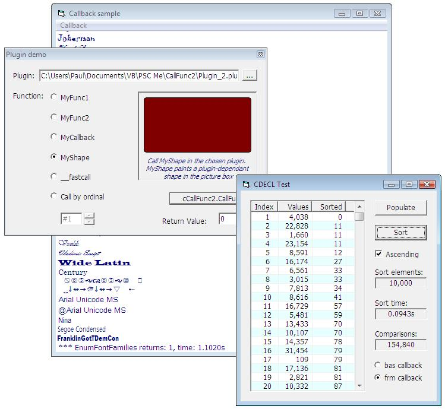



## Universal dll function caller, update

### Description

Just an update responding to previous user requests. Added fastcall support, call by pointer and every return type I could think of: Byte, Integer, Long, 64bit, Single, Double and none. March 10: two asm optimizations and some comments fixed. March 17: LaVolpe's requests added.
 
### More Info
 

             |
---                |---
**Submitted On**   |2008-03-12 11:48:24
**By**             |[Paul Caton](https://github.com/Planet-Source-Code/PSCIndex/blob/master/ByAuthor/paul-caton.md)
**Level**          |Intermediate
**User Rating**    |5.0 (110 globes from 22 users)
**Compatibility**  |VB 5\.0, VB 6\.0
**Category**       |[Miscellaneous](https://github.com/Planet-Source-Code/PSCIndex/blob/master/ByCategory/miscellaneous__1-1.md)
**World**          |[Visual Basic](https://github.com/Planet-Source-Code/PSCIndex/blob/master/ByWorld/visual-basic.md)
**Archive File**   |[Universal\_2106383172008\.zip](https://github.com/Planet-Source-Code/paul-caton-universal-dll-function-caller-update__1-70195/archive/master.zip)

